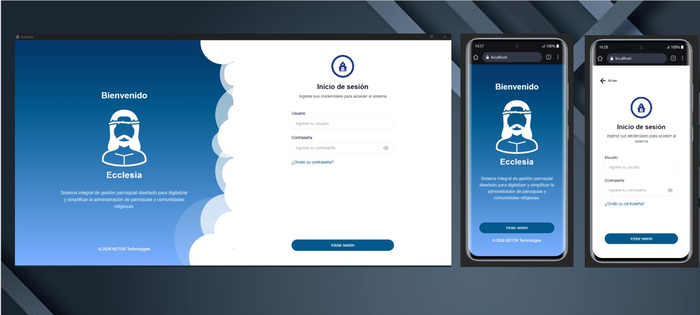

# Ecclesia Desktop App

  

<h3 align="center">
Sistema de gestión parroquial
</h3>

Aplicación de escritorio diseñada para facilitar la administración parroquial,
gestionando usuarios, sacramentos, registros y procesos internos de manera
simple, segura y eficiente.

---

## Características principales

- Gestión de usuarios y roles.
- Administración de sacramentos.
- Gestion contable 
- Registro y organización de información parroquial.
- Aplicación multiplataforma para Windows, Linux y macOS.
- Actualizaciones automáticas mediante GitHub Releases.
- Modo claro y oscuro

## Descargas

Puedes descargar la última versión desde:

➡️ **Releases:**  
https://github.com/ketopi/Ecclesia-Desktop-App/releases

## 👤 Autor

Desarrollado por **Kevin Torrez Pillco** 🚀

---

Desarrollado con dedicación para la gestión digital parroquial.

