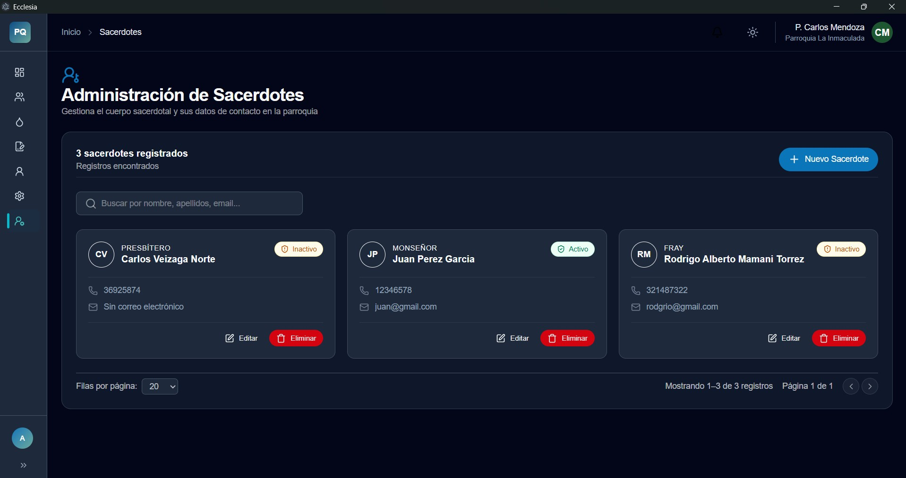
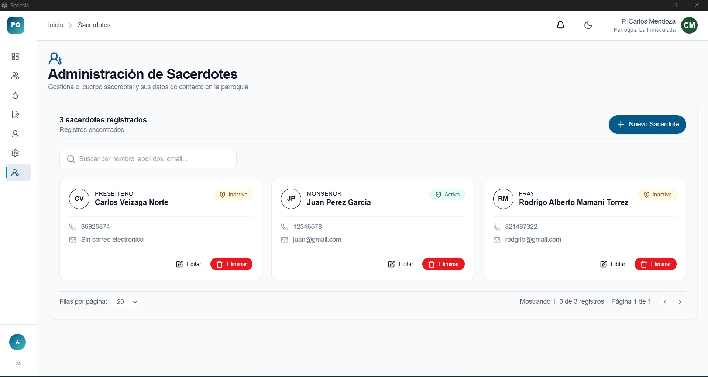

# Ecclesia Desktop App

  
  
  
  
  
  <h3>Sistema Moderno de Gestión Parroquial</h3>

  
Aplicación de escritorio diseñada para optimizar y facilitar la administración parroquial, gestionando usuarios, sacramentos, finanzas y procesos internos de manera simple, segura y eficiente.

  <!-- Insignias de tecnología -->
  

---

##  Características Principales

- **👥 Gestión de Usuarios y Roles:** Control de accesos y permisos seguros dentro del sistema.
- **⛪ Administración de Sacramentos:** Registro detallado de bautizos, confirmaciones, matrimonios y actas.
- **💰 Gestión Contable:** Control transparente de ingresos, egresos y finanzas parroquiales.
- **📂 Organización Parroquial:** Centralización y resguardo de la información de la comunidad.
- **💻 Multiplataforma:** Compilación nativa y fluida para Windows, Linux y macOS.
- **🔄 Actualizaciones Automáticas:** Integración directa con GitHub Releases para mantener la app al día.
- **🌓 Modo Claro y Oscuro:** Interfaz adaptativa para una mejor experiencia visual del usuario.

---

## 📥 Descargas

Puedes descargar la última versión estable directamente desde nuestro repositorio:

👉 **[Ver Últimas Releases](https://github.com/ketopi/Ecclesia-Desktop-App/releases)**

---

## 👤 Autor y Contacto

Desarrollado con dedicación y profesionalismo por **Kevin Torrez Pillco** 🚀

- 📱 **WhatsApp:** [Escríbeme por WhatsApp](https://wa.me/63945700)

---

  <i>Desarrollado para transformar y digitalizar la gestión parroquial.</i>

